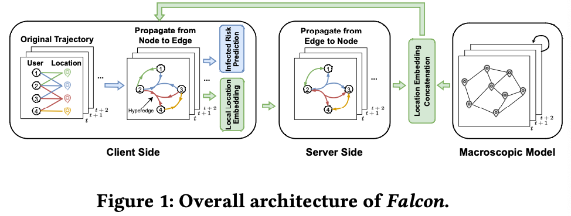

# (TOIS'23) Privacy-Preserving Individual-Level COVID-19 Infection Prediction via Federated Graph Learning

This is the Pytorch implementation of _Falcon_ (a **F**ederated gr**A**ph **L**earning method for privacy-preserving individual-level infe**C**tion predicti**ON**)



## Requirements

- torch>=1.11.0
- numpy>=1.23.4
- scikit-learn>=1.1.3
- torch_geometric>=2.1.0
- tensorboard>=2.11.0
- torchinfo>=1.7.1
- tqdm>=4.64.1

Dependency can be installed with the following command:

```bash
pip install -r requirements.txt
```

## Data Preparation
For the consideration of the user privacy, and avoid malicious usage of mobility data,the original mobility data is not publicly released. 
We will instead make the dataset available upon request to the corresponding author to researchers in the field for scientific purposes.

The preprocessed files (graph construction files, health status labels, etc.) for **Basic** scenario and **Larger** scenario,
i.e., `/basic` and `/larger`, are available at `/datasets/beijing`, and should be decompressed and put into the folder `/datasets/beijing`.


## Model Training

Here are commands for training the model on both **Basic** scenario and **Larger** scenario.


```bash
python train.py
```

To train on the different scenarios, 
please modify the _"dataset"_ item in the config file `config.json`

* ### Basic Scenario

    ```json
    "env_args":
    {
      "train_ratio": 0.4,
      "sim_days": 14,
      "seq_num": 1,
      "unique_len": 16,
      "dataset": "Basic"
    },
    ```

* ### Larger Scenario

    ```json
    "env_args":
    {
      "train_ratio": 0.4,
      "sim_days": 40,
      "seq_num": 1,
      "unique_len": 16,
      "dataset": "Larger"
    },
    ```
  
## Results Visualization

To activate the visualization of experiments, please to check up the item _"tensorboard"_ in `config.json` is set to true, 
then run the following command:
```bash
tensorboard --logdir runs --host 0.0.0.0
```
The visualization results can be found in [http://localhost:6006](http://localhost:6006)

## Citation
```
@article{10.1145/3633202,
author = {Fu, Wenjie and Wang, Huandong and Gao, Chen and Liu, Guanghua and Li, Yong and Jiang, Tao},
title = {Privacy-Preserving Individual-Level COVID-19 Infection Prediction via Federated Graph Learning},
year = {2023},
publisher = {Association for Computing Machinery},
address = {New York, NY, USA},
issn = {1046-8188},
url = {https://doi.org/10.1145/3633202},
doi = {10.1145/3633202},
abstract = {Accurately predicting individual-level infection state is of great value since its essential role in reducing the damage of the epidemic. However, there exists an inescapable risk of privacy leakage in the fine-grained user mobility trajectories required by individual-level infection prediction. In this paper, we focus on developing a framework of privacy-preserving individual-level infection prediction based on federated learning (FL) and graph neural networks (GNN). We propose Falcon, a Federated grAph Learning method for privacy-preserving individual-level infeCtion predictiON. It utilizes a novel hypergraph structure with spatio-temporal hyperedges to describe the complex interactions between individuals and locations in the contagion process. By organically combining the FL framework with hypergraph neural networks, the information propagation process of the graph machine learning is able to be divided into two stages distributed on the server and the clients, respectively, so as to effectively protect user privacy while transmitting high-level information. Furthermore, it elaborately designs a differential privacy perturbation mechanism as well as a plausible pseudo location generation approach to preserve user privacy in the graph structure. Besides, it introduces a cooperative coupling mechanism between the individual-level prediction model and an additional region-level model to mitigate the detrimental impacts caused by the injected obfuscation mechanisms. Extensive experimental results show that our methodology outperforms state-of-the-art algorithms and is able to protect user privacy against actual privacy attacks. Our code and datasets are available at the link: https://github.com/wjfu99/FL-epidemic.},
note = {Just Accepted},
journal = {ACM Trans. Inf. Syst.},
month = {dec},
keywords = {Privacy Protection, COVID-19 Infection Detection, Human Mobility}
}
```
